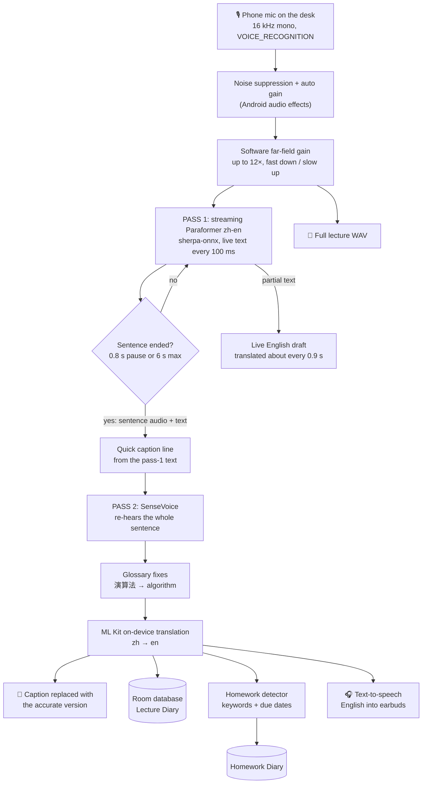
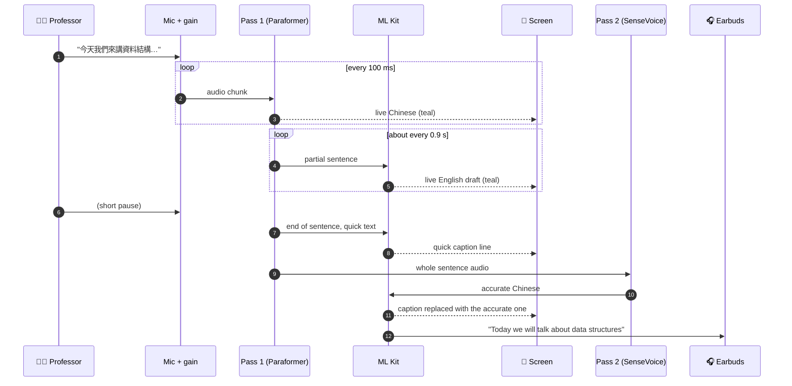
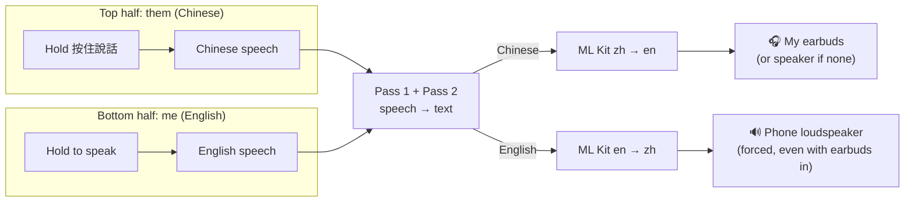
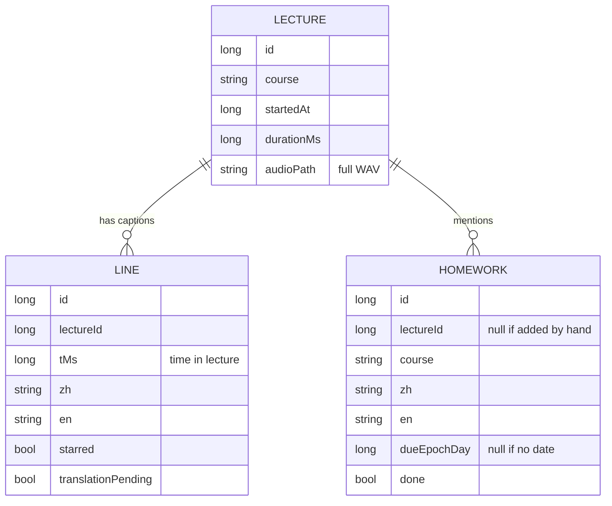

# Hanova

**Live English captions and spoken translation for Mandarin lectures, fully offline, on a normal Android phone.**

No API keys. No cloud. No subscription. After the first launch it works in airplane mode.

<p align="left">
  
  
  
  
</p>

---

## Why I built this

I was sitting in a lecture, and the professor was teaching in Mandarin.

I had my notebook open and my pen ready, the way I always do. The professor started, and within the first two minutes I realised I wasn't understanding *anything*. Not the topic, not the examples, not even when a joke landed and the whole room laughed. I just sat there, smiling a little late so I wouldn't look lost.

I kept waiting for a word I knew. Sometimes an English term would appear on a slide and I'd hold on to it like a lifeline, and then it would be gone and the Mandarin would carry on without me.

When class ended, everyone packed up and left talking about what we had just learned. I had a page with three words on it.

There were **no notes** to read later. No recording, no slides with the full content, nothing to go back to. Whatever was said in that room was gone. I had to piece the lecture together from scraps, ask classmates who were busy with their own work, and still guess what I had missed. Doing the homework felt impossible, because half the time I wasn't even sure what the homework *was*.

I tried Google Translate's conversation mode. It works fine when someone speaks right into your phone. But in a lecture hall the professor is far away, the phone is on my desk, and the room is full of noise. It caught a few words, and the rest was silence or nonsense.

It's a very lonely feeling, being in a room full of people learning something and being the only one locked out of it.

I'm a CSE student, so I thought: **I can't change the language the class is taught in, but maybe I can build the thing I wish I had in that seat.**

Something that:
- listens from **far away**, with the phone just lying on the desk,
- shows me **English while the professor is still talking**, not after,
- whispers the English **into my earbuds** so I can look at the board instead of my screen,
- keeps **every lecture as notes** I can read again at night,
- notices when the professor says *"homework… due next Wednesday"* and **writes it down for me**,
- helps me **talk back** to people, my English out loud in Chinese,
- and costs **nothing** and works **without internet**, because student life and data plans don't mix.

That's Hanova. Its mascot is **Hano**, a little dragon who listens so I don't have to sit there lost again.

---

## What it does

| | Feature | What it means for you |
|---|---|---|
| 🎓 | **Live lecture captions** | English appears *while* the professor speaks, with the Chinese underneath |
| 🎧 | **English voice in your earbuds** | Hear the translation privately while you watch the board |
| 📖 | **Lecture Diary** | Every class is saved with a timestamped bilingual transcript you can search and share |
| ⭐ | **Star important parts** | One tap marks "this will be on the exam" |
| 📝 | **Homework Diary** | "作業…下週三交" is detected automatically and lands in your to-do list with a due date |
| 🗣️ | **Conversation mode** | Split screen, hold to speak. Their Chinese → English in your ears; your English → Chinese out loud from the phone speaker |
| 🎙️ | **Full lecture recording** | The whole class is saved as a WAV, so it can be re-transcribed later with a bigger model |
| 🔊 | **Voice picker** | Choose from the offline voices on your phone (American, Indian, British English; Taiwan Mandarin) and set the speed |
| ✈️ | **100% offline** | Speech recognition, translation and voice all run on the phone |

---

## How it works

### The whole pipeline



### Why two passes?

Live captions and accurate captions want opposite things, so Hanova uses two models.

| | Pass 1: Paraformer (streaming) | Pass 2: SenseVoice (offline) |
|---|---|---|
| Job | Instant text + decide where sentences end | Re-hear the full sentence carefully |
| Speed | Real time, every 100 ms | ~0.5–1 s per sentence |
| Strength | Fast, never waits | Much better on **far, noisy** audio; adds punctuation |
| Shown as | Teal live text, then a quick caption | The final caption that replaces the quick one |

If sentences start piling up (more than 3 waiting), Hanova **skips pass 2** for a while so captions never fall behind the professor.

### A sentence, from voice to earbuds



### Conversation mode and where the sound goes

The screen is split. The top half is upside down so the person across the table can read it. Each person holds their own button to speak.



Android's text-to-speech can't choose an output device, so for "Chinese out loud while my earbuds are connected" Hanova renders the speech to a file and plays it with `MediaPlayer.setPreferredDevice(builtin speaker)`. Pressing a talk button instantly stops any voice still playing, so the mic never hears the phone's own voice.

In **lecture mode** the English voice plays **only in earbuds**. Out loud it would disturb the class, and the mic would start translating the phone instead of the professor. If the voice falls behind, older lines are skipped (they stay on screen) so what you hear is always *now*.

### What gets saved



### Homework detection

Fully offline rules, no AI service. A line counts as homework when it contains words like **作業 / 報告 / 繳交 / 考試** or **homework / assignment / due**, and the due date is worked out from phrases like:

| Said in class | Becomes |
|---|---|
| 下週三 / next Wednesday | Wednesday of next week |
| 明天 / tomorrow | tomorrow's date |
| 10月14日 | 14 October |
| by Friday / 這週五 | the coming Friday |

### Safety nets

| If… | Hanova… |
|---|---|
| The phone gets busy and sentences pile up | skips pass 2 and uses the quick text, so captions stay live |
| Translation fails | keeps the Chinese, shows "(translation pending)" and retries when you press Stop |
| Recognition was weak on something important | the **full lecture WAV** is saved next to the diary, so it can be re-transcribed later on a laptop |
| The voice falls behind | skips older lines so you hear the current one |
| Noise produces "嗯 / um" | filler-only lines are dropped |

---

## Tech stack

| Layer | What | Why |
|---|---|---|
| Speech recognition (live) | [sherpa-onnx](https://github.com/k2-fsa/sherpa-onnx) streaming **Paraformer** bilingual zh-en (int8) | Real-time, on-device, handles mixed Chinese + English terms |
| Speech recognition (accurate) | sherpa-onnx **SenseVoice** zh/en/ja/ko/yue (int8) | Robust on distant, noisy audio; punctuation |
| Translation | Google **ML Kit** on-device Translation | Free, offline after a one-time ~30 MB download per language |
| Voice | Android **TextToSpeech** (Google TTS offline voices) | Free, natural enough, many accents |
| UI | **Jetpack Compose**, Navigation Compose, Nunito font | Calm, minimal "paper" design |
| Storage | **Room** (SQLite) | Lecture Diary + Homework Diary |
| Language | **Kotlin** + coroutines | |

Design: warm paper background `#FBFAF3`, plum ink `#3E2F38`, teal accent `#0F7A64`, homework amber `#F6E6D3`. Hano comes in four moods (happy, listening, reading, sleepy) as vector drawables.

---

## Project structure

```
app/src/main/java/com/nandini/hanova/
├── HanovaApp.kt              # loads models + translators once at startup
├── AsrEngine.kt              # mic, gain, streaming recognition, sentence endings
├── AccurateAsr.kt            # SenseVoice second pass
├── Translator.kt             # SentenceTranslator interface, ML Kit, Glossary
├── VoiceOut.kt               # text-to-speech queue, earbuds vs loudspeaker
├── Filler.kt                 # drops "嗯 / um" noise lines
├── MainActivity.kt           # navigation
├── data/Db.kt                # Room: Lecture, Line, Homework
├── homework/HomeworkDetector.kt
├── lecture/                  # LectureViewModel, WavWriter
├── conversation/             # ConversationViewModel
└── ui/                       # theme, components (Hano, buttons), screens
```

---

## Build it yourself

You need Android Studio (or just the Android SDK), **JDK 17–21**, and an **arm64** Android phone (Android 8.0+).

```bash
git clone https://github.com/NANDINI502/HANOVA.git
cd HANOVA
bash setup.sh            # downloads the sherpa-onnx library, 2 speech models, the font (~500 MB)
./gradlew assembleDebug
adb install -r app/build/outputs/apk/debug/app-debug.apk
```

- On Windows, run `setup.sh` from **Git Bash**.
- If Gradle fails with a Java version error, point `JAVA_HOME` at a JDK 21 (Android Studio's newest bundled JDK can be too new for Gradle 8.10).
- **First launch needs internet once**, so ML Kit can download the translation models. After that, airplane mode works.
- For Chinese voice output, the phone needs a Chinese text-to-speech voice. Hanova uses Google TTS and shows a "tap to download" hint if one is missing.

The APK is about **500 MB**, because both speech models are bundled and stored uncompressed.

---

## Privacy

Everything stays on your phone: audio, transcripts and homework. Nothing is uploaded anywhere. The only network use is the one-time download of the translation models.

---

## Known limits

- **Distance still matters most.** Sit closer, or use a cheap clip-on mic for big halls.
- The English voice is **about 2–6 s behind** the professor, because it speaks once a sentence is complete. Live captions on screen are much closer.
- Translations are machine translations; technical terms improve when you add them to the `Glossary`.
- Chinese output is in simplified characters (spoken with a Taiwan Mandarin voice).
- Taiwanese Hokkien is not recognised.

## What's next

- [ ] "Fast voice" mode: speak in shorter chunks for ~1.5–3 s delay
- [ ] Natural-sounding neural voice (sherpa-onnx TTS)
- [ ] Re-transcribe the saved WAV with a bigger model on a laptop
- [ ] Course-specific glossaries
- [ ] Summaries of each lecture, offline

---

*Built by a student who once sat through a whole lecture understanding nothing, so the next one wouldn't feel that way.* 🐉
